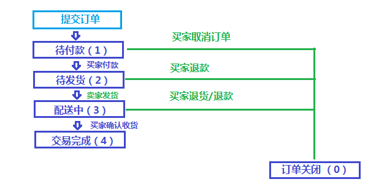

# onlybuy 商城项目开发文档
## 作者
 - 孙涛
## 版权
 - www.tedu.cn

## 项目介绍
- onlybuy 商城项目是利用 Django 实现在电商在线商品销售和购买平台，能够为买家和卖家建立一个沟通和交互的桥梁
- onlybuy 项目架构整体围绕三部分构成:
    1. 买家购物系统;
    2. 卖家商品管理系统;
    3. 管理员授权管理
- 功能:
  - 功能根据买家，卖家，管理员大致分为三类:
      - 买家，商品展示，加入购物车，下单，支付，查看商品物流等信息
      - 买家，商品编辑，商品信息管理与维护，商品上架，商品下架，商品分类管理...
      - 管理员,商品上架审批，商户管理，首页管理,广告位管理等

## 设计开发人员:
```
吕璐、瞿昊旻、许海越、魏明择、赵旭、赵蒙蒙、石博文、龚研、屈云将、冯腾飞、高娜...
```

## 目录

<!-- TOC depthFrom:3 depthTo:5 -->

- [运行环境](#运行环境)
- [需求功能简介](#需求功能简介)
- [功能介绍](#功能介绍)
- [项目代码模块介绍](#项目代码模块介绍)
- [详细设计](#详细设计)
- [路由](#路由)
    - [首页路由规范](#首页路由规范)
    - [买家路由规范](#买家路由规范)
    - [商品模块图由规范](#商品模块图由规范)
    - [购物车 cart 模块路由规范](#购物车-cart-模块路由规范)
    - [收藏模块模块路由规范](#收藏模块模块路由规范)
    - [卖家路由规范](#卖家路由规范)
    - [验证码路由规范](#验证码路由规范)
    - [管理员路由规范](#管理员路由规范)
- [静态资源管理:](#静态资源管理)
    - [图片资源管理](#图片资源管理)
        - [商品信息图片管理规范](#商品信息图片管理规范)
        - [静态图片资源管理规范](#静态图片资源管理规范)
    - [css 样式表资源管理规范](#css-样式表资源管理规范)
    - [javascript 静态文件管理规范](#javascript-静态文件管理规范)
- [商城项目 AJax 请求 json 数据传送格式规范](#商城项目-ajax-请求-json-数据传送格式规范)
    - [订单的处理流程](#订单的处理流程)

<!-- /TOC -->
### 运行环境
- python3 + django 1.11.x + mysql 8.0.x
- 操作系统
    - Linux
    - Mac OS X
    - Windows(暂不支持)

### 需求功能简介
- 使用本软件的人有三类人：
    - 买家
    - 卖家(店铺及店员)
    - 管理员
- 以上三类人员通过 权限管理 实现不同的分工，以实现商品在线买卖的流程

### 功能介绍
- 以下为三类人群的基本功能介绍
- 买家:
    - 普通用户注册
    - 普通用户登陆
    - 商品加入购物车
    - 下单
    - 支付
    - 商品加入收藏夹
- 卖家:
    - 添加、编辑商品
    - 商品上架申请
    - 商品下架管理
    - 发货(待完善)
    - 收款(待完善)
- 管理员:
    - 添加卖家功能
    - 禁用卖家功能
    - 卖家权限管理
<!-- 待加入...
- 附加功能
    - 防SQL注入攻击
    - 反爬虫
 -->

### 项目代码模块介绍
- 普通用户信息管理模块`user` ('/user/*)
- 卖家管理模块`sale` ('/sale/user/*')
    - 卖家用户信息管理模块('/sale/user/*')
    - 卖家商品信息管理模块('/sale/goods/*')
- 管理员模块`administrator` ('/administrator/*')
- 商品模块`goods` ('/goods/*')
- 购物车模块 `cart` ('/cart/*')
- 商品收藏模块 `favorite` ('/favorite/*')
- 订单模块 `order` ('/order/*')
- 支付模块 `pay` ('/pay/*')
- 验证码模块 `verify` ('/verify/*')
- 收货地址模块 `address` ('/address/*')
- 电子邮件模块 `email` ('/email/*')
    > 注: 以上每个模块对应一个Django的app

<!-- 待完成
###### 项目模块关系图
 -->

<!-- 待完成
###### 数据库设计
 -->

### 详细设计
- 数据库设计:
  - 数据库使用mysql 数据库，数据库的名称为`onlybuy'
- Django 结构
  - 架构模式为前后端不分离模式，由Django后端以填充模板的方式向前端提供html页面和 部分json数据
- 

### 路由
- 此处为模块的路由URL规范
#### 首页路由规范
| 路由 | 说明 | 请求类型 |
|-|-|-|
| ／           | 网站相关页面头部 | GET  |
| ／index.html | 网站主页       |  GET  |
| ／header.html | 网站相关页面头部 | GET  |
| ／footer.html | 网站相关页面底部 | GET  |


#### 买家路由规范
| 路由 | 说明 | 请求类型 |
|-|-|-|
| /user/login/ | 买家登陆 | GET/POST
| /user/logout/ | 买家退出登陆 | GET

#### 商品模块图由规范
| 路由 | 说明 | 请求类型 |
|-|-|-|
| /goods/list/ | 列出所有商品 | GET |
| /goods/list/<type_id>/ | 列出类型为type_id的所有商品 | GET |
| /goods/detail/<goods_id> | 显示商品某个商品详情页 | GET |
| /goods/detail/<goods_id>/<spec_id> | 显示商品"某个规格"的详情页 | GET |


#### 购物车 cart 模块路由规范
| 路由 | 说明 | 请求类型 |
|-|-|-|
| /cart/                        | 显示当前购物车商品信息                   | GET |
| /cart/add/<spec_id>)/<goods_count>/ | 添加指定规格和个数的商品到购物车        | GET |
| /cart/add_ajax/<spec_id>)/<goods_count>/ | 添加指定规格和个数的商品到购物车(for Ajax请求) |GET |
| /cart/delete/<cart_item_id>)/           | 删除购物车中规格id为spec_id的的商品       | GET |
| /cart/delete_ajax/<cart_item_id>)/ | 删除购物车中规格id为spec_id的的商品(for Ajax请求)| GET |
| /cart/clear_all/              | 删除购物车中的全部商品                   | GET |


#### 收藏模块模块路由规范
| 路由 | 说明 | 请求类型 |
|-|-|-|
| /favorite/                         | 显示收藏夹中的全部       | GET |
| /favorite/add/<spec_id>/           | 添加商品到收藏夹        | GET |
| /favorite/add_ajax/<spec_id>/     | 添加商品到收藏夹(for Ajax请求)  | GET |
| /favorite/delete/<fav_id>/             | 从收藏夹中删除物品       | GET |
| /favorite/delete_ajax/<fav_id>/       | 从收藏夹中删除物品(for Ajax请求)  | GET |
| /favorite/clear_all/                | 从收藏夹删除全部        | GET |


#### 卖家路由规范
| 路由 | 说明 | 请求类型 |
|-|-|-|
| ／sale/ | 卖家功能主页 | GET
| ／sale/user/login/ | 卖家登陆页面 | GET/POST |
| 以下路由只能对已登陆买家访问 |
| ／sale/user/logout/ | 卖家退出用户登陆 | GET |
| ／sale/user/mod_password/ | 卖家修改用户密码 | GET/POST |
| ／sale/goods/new_goods/ | 新添加商品 | GET/POST |
| ／sale/goods/mod/ | 编辑商品 | GET/POST |
| ／sale/goods/new_shelves/ | 已编辑商品上架 | GET/POST |
| ／sale/goods/closed_shelves/ | 已上架商品下架 | GET/POST |
| ／sale/goods/preview/ | 正在编辑商品预览 | GET |


#### 验证码路由规范
| 路由 | 说明 | 请求类型 |
|-|-|-|
| ／verify/code.png | 获取验证码图片(同时更新此客户端验证的session.verify字符串) | GET
- 注: 此路由对所有用户可以访问


#### 管理员路由规范
| 路由 | 说明 | 请求类型 |
|-|-|-|
| /administrator/login/ | 管理员登陆 | GET/POST
| /administrator/logout/ | 管理员退出登陆 | GET
| /administrator/mod_password/ | 管理员修改用户密码 | GET/POST
| 后台管理模块| |
| /administrator | 
| /administrator/managementHome | 后台管理主页	| GET |
| 商品管理 | 
| /administrator/searchGoods | 搜索商品 | GET/POST
| /administrator/closedGoods | 下架商品 | GET/POST
| 分类管理| 
| /administrator/searchClassification | 搜索分类 | GET/POST
| /administrator/closedClassification | 删除分类 | POST
| /administrator/increaseClassification | 增加分类 | POST
| 增加用户| 
| /administrator/increaseSaller| 增加卖家 | GET/POST
- 注: 此路由只能供管理员访问


### 静态资源管理:
#### 图片资源管理
<!-- 
########### 用户信息图片
- 访问路径URL: `/images/users/用户id/xxx.png`
- 存储路径位置: `/static/images/users/用户id_profile.png`
 -->

##### 商品信息图片管理规范
-  商品展示图片
    - 访问路径URL: `/images/goods/商品id/xxx.png`
    - 存储路径位置: `/static/images/goods/商品id/xxx.png`
    - 说明:
        - 商品展示图片的第一张图片作用列表显示的主图

-  商品详情图片
    - 访问路径URL: `/images/goods/商品id/detail/xxx.png`
    - 存储路径位置: `/static/images/goods/商品id/detail/xxx.png`

##### 静态图片资源管理规范
- 全局的图片文件(如:logo.png) 和 买家页面的图片文件
    - 访问路径URL: `/images/xxx.jpg`
    - 存储路径位置: `/static/images/xxx.jpg`
- 后管管理员页面相关的 图片 文件
    - 访问路径URL: `/images/administrator/xxx.jpg`
    - 存储路径位置: `/static/images/administrator/xxx.jpg`
- 商品管理管理员页面相关的 图片 文件
    - 访问路径URL: `/images/sale/xxx.jpg`
    - 存储路径位置: `/static/images/sale/xxx.jpg`

#### css 样式表资源管理规范
- 全局的 css 和 买家页面的 css 文件
    - 访问路径URL: `/css/xxx.css`
    - 存储路径位置: `/static/css/xxx.css`
- 后管管理员页面相关的css 
    - 访问路径URL: `/css/administrator/xxx.css`
    - 存储路径位置: `/static/css/administrator/xxx.css`
- 商品管理管理员页面相关的css 
    - 访问路径URL: `/css/sale/xxx.css`
    - 存储路径位置: `/static/css/sale/xxx.css`

#### javascript 静态文件管理规范
- 全局的js文件 和 买家页面的js文件
    - 访问路径URL: `/js/xxx.js`
    - 存储路径位置: `/static/js/xxx.js`
- 后管管理员页面相关的 js 文件
    - 访问路径URL: `/js/administrator/xxx.js`
    - 存储路径位置: `/static/js/administrator/xxx.js`
- 商品管理管理员页面相关的 js 文件
    - 访问路径URL: `/js/sale/xxx.js`
    - 存储路径位置: `/static/js/sale/xxx.js`


### 商城项目 AJax 请求 json 数据传送格式规范
1. Json 发送数据包格式及参数提交
    ```json 
    {"key1":"value1","key2":[1,2,3]}
    ```

2. 返回体格式：
    ```json
    {
        "status": 200,
        "message": "用户查询返回成功",
        "data": {
            "id":"1122334455667788",
            "name": "tedu",
            "age": 18
        }
    }
    ```
3. 注意事件
    - 每个请求的返回必须是完整的 json 数据（如:`{"status":200, "message":"OK"}`,不充许直接返回字符串如:`"OK"`
    - 返回体格式一定要包含两项`status`和 `message`,其它可以自定义
        - `status`:表求返回状态(整数)，
        - `message`:表求返回状态(UTF-8编码格式的字符串)，
    
4. json status 状态码表
   - 此状态码的含义取其于 http 状态码,如有其它需求再自定义添加

| 分类 | 状态码 | 说明 |
|:-:|:-:|:-|
|　　2XX系列 | |代表请求已成功被服务器接收、理解、并接受。这系列中最常见的有200、201状态码。
|   | 200 | 表示请求已成功，请求所希望的响应头或数据体将随此响应返回
|   | 201 | 表示请求成功并且服务器创建了新的资源，且其 URI 已经随Location 头信息返回。假如需要的资源无法及时建立的话，应当返回 '202 Accepted'
|   | 202 | 服务器已接受请求，但尚未处理
| 4XX系列 | | 表示请求错误。代表了客户端看起来可能发生了错误，妨碍了服务器的处理。常见有：401、404状态码。
| | 401 | 请求要求身份验证。 对于需要登录的网页，服务器可能返回此响应。
| | 403 | 服务器已经理解请求，但是拒绝执行它。与401响应不同的是，身份验证并不能提供任何帮助，而且这个请求也不应该被重复提交。
| | 404 | 请求失败，请求所希望得到的资源未被在服务器上发现。没有信息能够告诉用户这个状况到底是暂时的还是永久的。假如服务器知道情况的话，应当使用410状态码来告知旧资源因为某些内部的配置机制问题，已经永久的不可用，而且没有任何可以跳转的地址。404这个状态码被广泛应用于当服务器不想揭示到底为何请求被拒绝或者没有其他适合的响应可用的情况下。
| 5xx系列 || 代表了服务器在处理请求的过程中有错误或者异常状态发生，也有可能是服务器意识到以当前的软硬件资源无法完成对请求的处理。常见有500、503状态码。
| | 500 | 服务器遇到了一个未曾预料的状况，导致了它无法完成对请求的处理。一般来说，这个问题都会在服务器的程序码出错时出现。
| | 503 | 由于临时的服务器维护或者过载，服务器当前无法处理请求。通常，这个是暂时状态，一段时间会恢复

#### 订单的处理流程
